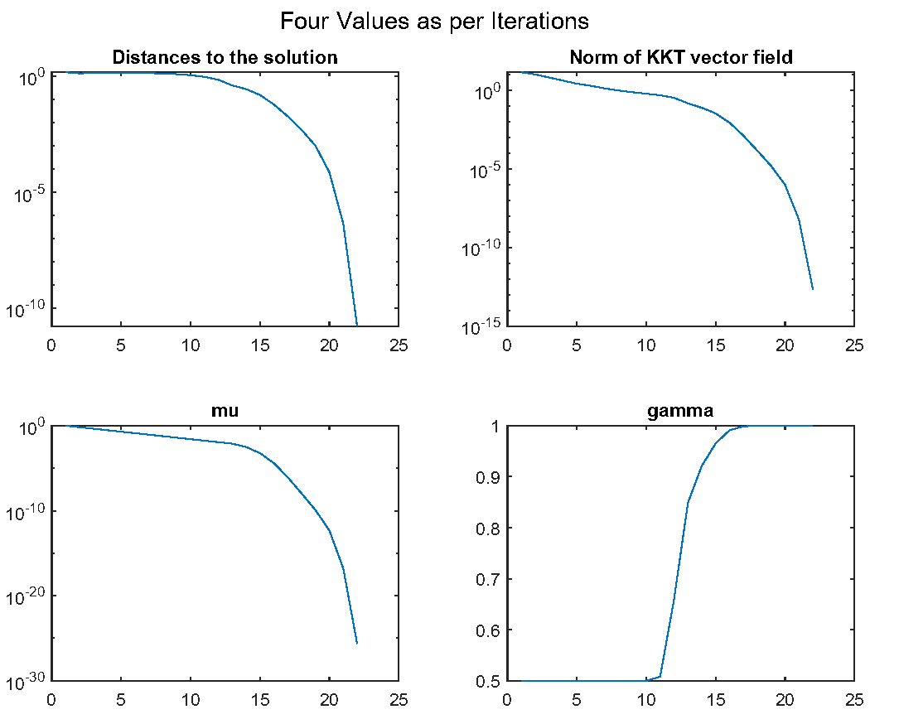

`PrototypeRIPM.m` gives a simple example about the usage of Local/Prototype Algorithm RIPM to solve the following (RCOP) problem:
$$
\min _{x \in \mathbb{S}^{n-1}} a^T x \quad \text { s.t. } \quad x \geq 0,
$$
where $\mathbb{S}^{n-1}:=\left\{x \in \mathbb{R}^n:\|x\|_2=1\right\}$ is the sphere manifold and $a \in \mathbb{R}^n$ is some constant vector. 

See `PrototypeRIPM.m` for details. 

By running `PrototypeRIPM. m`, we obtain the figure below. Its iteration results show the quadratic convergence of Algorithm 2.

